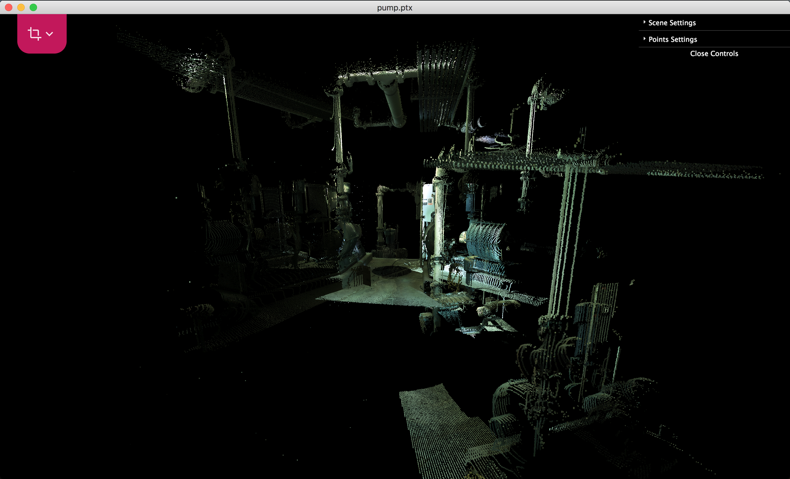

# Retrofire

This is a point cloud processing software, designed for simple, silly point cloud operations, i.e. viewing, cropping, etc.

It currently supports ASCII point clouds (i.e. ptx, pts, xyz) only. Other formats are waiting for development.

### Technical Profile
This application is based on [Electron](https://github.com/electron/electron), [Angular](https://github.com/angular/angular) frameworks. Main viewer is based on [three.js](https://github.com/mrdoob/three.js).

### Usage
Build for Mac:
~~~
$ npm i
$ npm run build:mac
~~~
Then it can be found under ./release-builds.

Other build method can be found [here](https://www.christianengvall.se/electron-packager-tutorial/).

Developing:
~~~
$ npm run dev
~~~

### Screenshots

